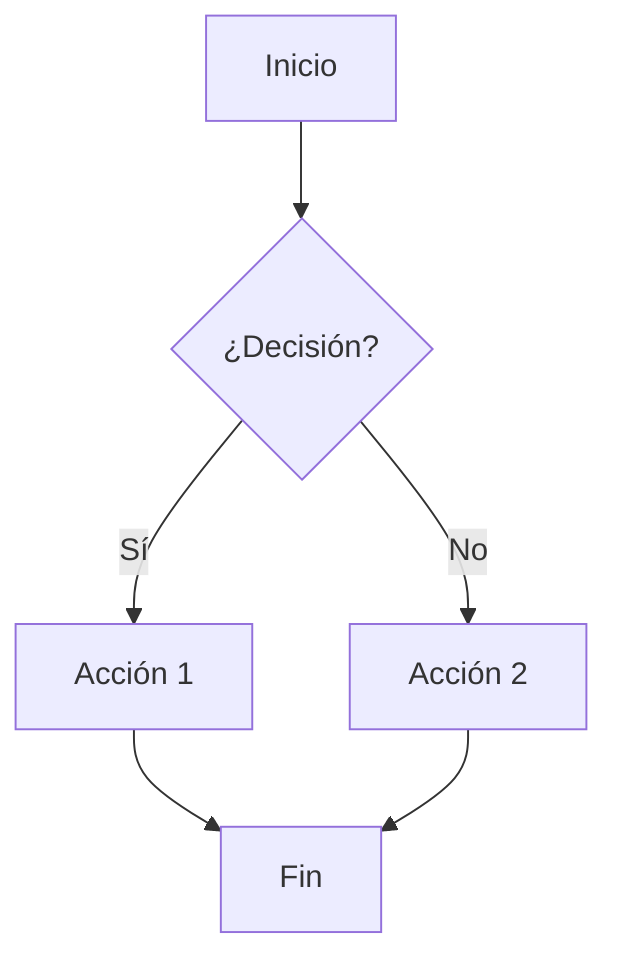
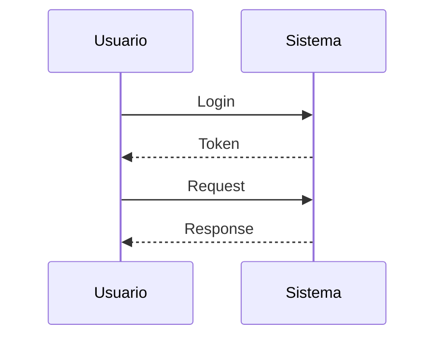
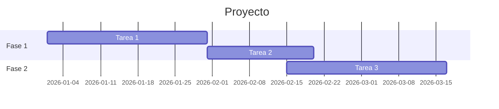

# Test Mermaid

## Flowchart

```mermaid
flowchart TD
    A[Inicio] --> B{¿Decisión?}
    B -->|Sí| C[Acción 1]
    B -->|No| D[Acción 2]
    C --> E[Fin]
    D --> E
```

## Sequence Diagram

```mermaid
sequenceDiagram
    participant Usuario
    participant Sistema
    Usuario->>Sistema: Login
    Sistema-->>Usuario: Token
    Usuario->>Sistema: Request
    Sistema-->>Usuario: Response
```

## Gantt Chart

```mermaid
gantt
    title Proyecto
    dateFormat  YYYY-MM-DD
    section Fase 1
    Tarea 1     :a1, 2026-01-01, 30d
    Tarea 2     :after a1, 20d
    section Fase 2
    Tarea 3     :2026-02-15, 30d
```